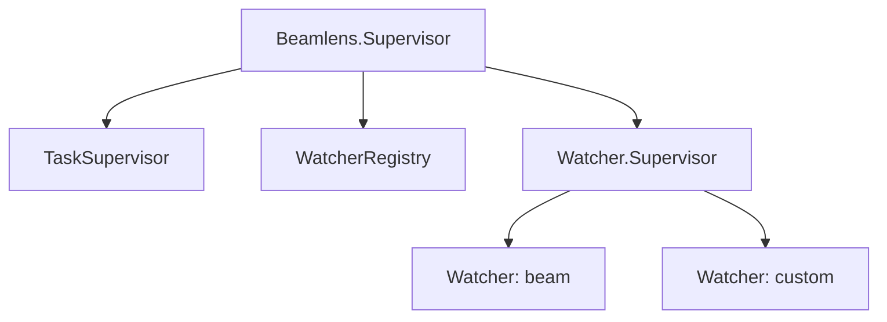
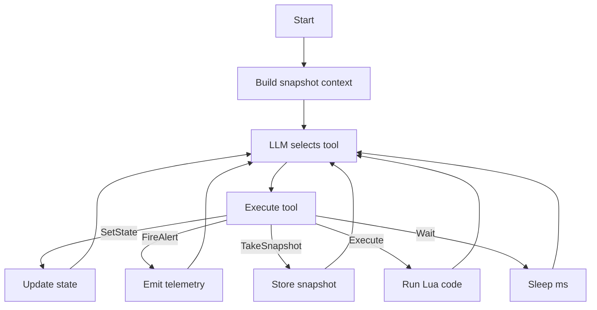

# Architecture

BeamLens uses an **autonomous watcher** architecture where specialized watchers run continuous LLM-driven loops to monitor domains and detect anomalies. Alerts are emitted via telemetry.

## Supervision Tree

Add BeamLens to your application's supervision tree:

```elixir
{Beamlens, watchers: [:beam]}
```

This starts the following components:



Each watcher runs independently. If one crashes, others continue operating.

## Watcher Loop

Each watcher is a GenServer running a continuous LLM-driven loop:



The LLM controls the loop timing via the `wait` tool. There are no fixed schedules.

## State Model

Watchers maintain one of four states reflecting current assessment:

| State | Description |
|-------|-------------|
| `healthy` | Everything is normal |
| `observing` | Something looks off, gathering more data |
| `warning` | Elevated concern, not yet critical |
| `critical` | Active issue requiring attention |

State transitions are driven by the LLM via the `set_state` tool.

## Available Tools

| Tool | Description |
|------|-------------|
| `set_state` | Update watcher state with reason |
| `fire_alert` | Create alert with referenced snapshots |
| `get_alerts` | Retrieve previous alerts for correlation |
| `take_snapshot` | Capture current metrics with unique ID |
| `get_snapshot` | Retrieve specific snapshot by ID |
| `get_snapshots` | Retrieve multiple snapshots with pagination |
| `execute` | Run Lua code with metric callbacks |
| `wait` | Sleep before next iteration (LLM-controlled timing) |

## Lua Callbacks

The `execute` tool runs Lua code in a sandbox with access to metric callbacks:

| Callback | Description |
|----------|-------------|
| `get_memory()` | Memory breakdown: total, processes, binary, ETS, code |
| `get_processes()` | Process and port counts with limits |
| `get_schedulers()` | Scheduler counts and run queue depth |
| `get_atoms()` | Atom table count, limit, memory |
| `get_system()` | Node identity, OTP version, uptime |
| `get_persistent_terms()` | Persistent term count and memory |
| `top_processes(limit, sort_by)` | Top N processes by memory, message queue, or reductions |

Example Lua code:

```lua
local mem = get_memory()
local procs = top_processes(5, "memory")
return {memory = mem, top_procs = procs}
```

## Telemetry Events

Watchers emit telemetry events for observability. Key events:

| Event | Description |
|-------|-------------|
| `[:beamlens, :watcher, :started]` | Watcher initialized |
| `[:beamlens, :watcher, :state_change]` | State transitioned |
| `[:beamlens, :watcher, :alert_fired]` | Alert created |
| `[:beamlens, :watcher, :iteration_start]` | Loop iteration began |
| `[:beamlens, :llm, :start]` | LLM call started |
| `[:beamlens, :llm, :stop]` | LLM call completed |

Subscribe to alerts:

```elixir
:telemetry.attach("my-alerts", [:beamlens, :watcher, :alert_fired], fn
  _event, _measurements, %{alert: alert}, _config ->
    Logger.warning("Alert: #{alert.summary}")
end, nil)
```

See `Beamlens.Telemetry` for the complete event list.

## LLM Integration

BeamLens uses [BAML](https://docs.boundaryml.com) for type-safe LLM prompts via [Puck](https://github.com/bradleygolden/puck). One BAML function handles the watcher loop:

- **WatcherLoop**: Continuous agent loop that observes metrics and selects tools

Default LLM: Anthropic Claude Haiku (`claude-haiku-4-5-20251001`)

## LLM Client Configuration

Configure alternative LLM providers via `:client_registry`:

```elixir
{Beamlens,
  watchers: [:beam],
  client_registry: %{
    primary: "Ollama",
    clients: [
      %{name: "Ollama", provider: "openai-generic",
        options: %{base_url: "http://localhost:11434/v1", model: "llama3"}}
    ]
  }
}
```

See [providers.md](providers.md) for configuration examples.

## Included Domains

### BEAM Domain (`:beam`)

Monitors BEAM VM runtime health.

**Snapshot Metrics** (checked each iteration):
- Memory utilization %
- Process utilization %
- Port utilization %
- Atom utilization %
- Scheduler run queue depth
- Schedulers online

**Lua Callbacks** (available in `execute` tool):

| Callback | Description |
|----------|-------------|
| `get_memory()` | Memory breakdown by category |
| `get_processes()` | Process/port counts and limits |
| `get_schedulers()` | Scheduler stats and run queue |
| `get_atoms()` | Atom table statistics |
| `get_system()` | Node info, OTP version, uptime |
| `get_persistent_terms()` | Persistent term count and memory |
| `top_processes(limit, sort_by)` | Top processes by memory/queue/reductions |

## Custom Domains

Implement the `Beamlens.Domain` behaviour to create custom monitoring domains:

```elixir
defmodule MyApp.Domain.Postgres do
  @behaviour Beamlens.Domain

  @impl true
  def domain, do: :postgres

  @impl true
  def snapshot do
    %{
      active_connections: count_active(),
      pool_size: pool_size(),
      query_queue_depth: queue_depth()
    }
  end

  @impl true
  def callbacks do
    %{
      "get_slow_queries" => &slow_queries/0,
      "get_pool_stats" => &pool_stats/0
    }
  end
end
```

Register in supervision tree:

```elixir
{Beamlens, watchers: [
  :beam,
  [name: :postgres, domain_module: MyApp.Domain.Postgres]
]}
```
